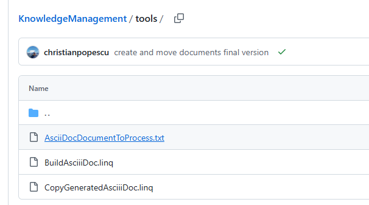

= Backlog
Doc Writer <christian.popescu@outlook.com>
v 1.1, 2025-06-05
:sectnums:
:toc:
:toclevels: 5

== Introduction 

This documents helps to keeps and manage backlog.

== Backlog list

=== 01 - [.line-through]#Simple documentation structure#  -> 08/06/2025

Define simple documentation structure as static site and asciidoc element.

=== 02 - Create library that create / deploy documentation

The library allows to create documentation HTML / PDF and to deploy.

Use as model

https://github.com/christianpopescu/KnowledgeManagement/tree/master/tools[Model]

