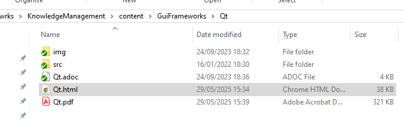

= Worklog
:allow-uri-read:

== 29/09/2025 - Reactivate project

[source, bash]
----
##  Create C# solution that contains C# project console

dotnet new sln -n DocumentHelper

## Add console preoject

dotnet new console -o SandboxConsole --framework net8.0 --use-program-main

## Add project to solution
dotnet sln add .\SandboxConsole\SandboxConsole.csproj

----

Tested

[source]
----
include::../src/CSharp/DocumentHelper/SandboxConsole/Workspace/Wrk-01-Asciidoc-to-html-and_pdf.cs[]
----

[source]
----
link::https://github.com/christianpopescu/DocumentHelper/blob/main/src/CSharp/DocumentHelper/SandboxConsole/Workspace/Wrk-01-Asciidoc-to-html-and_pdf.cs[]
----

include::https://github.com/christianpopescu/DocumentHelper/blob/main/src/CSharp/DocumentHelper/SandboxConsole/Workspace/Wrk-01-Asciidoc-to-html-and_pdf.cs[]

Result

